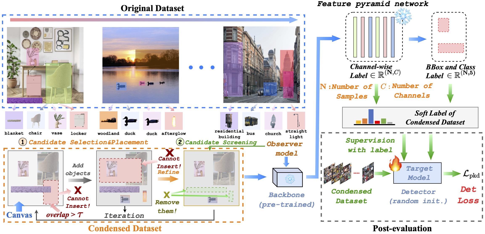

#  🚀 OD<sup>3</sup>: Optimization-free Dataset Distillation for Object Detection

<div align="center">

<a href="https://github.com/salwaalkhatib">Salwa K. Al Khatib</a><sup>1*</sup>, <a href="https://www.linkedin.com/in/ahmed-adel-elhagry">Ahmed ElHagry</a><sup>1*</sup>, <a href="https://github.com/shaoshitong">Shitong Shao</a><sup>2,1*</sup>, <a href="https://github.com/szq0214">Zhiqiang Shen</a><sup>1</sup>

<sup>1</sup>MBZUAI <sup>2</sup>HKUST (Guangzhou) <sup>*</sup>Equal contributors


 
<a href='https://arxiv.org/abs/2506.01942' target="_blank"></a> [](https://huggingface.co/datasets/VILA-Lab/OD3)</a> [](https://x.com/vila_shen_lab)
 </div>

## 🧠 Abstract
Training large neural networks on large-scale datasets requires substantial computational resources, particularly for dense prediction tasks such as object detection. Although dataset distillation (DD) has been proposed to alleviate these demands by synthesizing compact datasets from larger ones, most existing work focuses solely on image classification, leaving the more complex detection setting largely unexplored. In this paper, we introduce OD<sup>3</sup>, a novel optimization-free data distillation framework specifically designed for object detection. Our approach involves two stages: first, a candidate selection process in which object instances are iteratively placed in synthesized images based on their suitable locations, and second, a candidate screening process using a pre-trained observer model to remove low-confidence objects. We perform our data synthesis framework on MS COCO and PASCAL VOC, two popular detection datasets, with compression ratios ranging from 0.25% to 5%. Compared to the prior solely existing dataset distillation method on detection and conventional core set selection methods, OD<sup>3</sup> delivers superior accuracy and establishes new state-of-the-art results, surpassing the prior best method by more than 14% on COCO mAP<sub>50</sub> at a compression ratio of 1.0%.
<p align="center">
    
</p>


## ⚙️ Installation

The code has been tested with: Python 3.9, CUDA 11.3, PyTorch 1.12.1

Follow this official [guide](https://mmdetection.readthedocs.io/en/latest/get_started.html) on how to setup the <code>openmmlab</code> environment.

## 🎯 Pre-trained Observer

Download checkpoints for [FasterRCNN-R101](https://download.openmmlab.com/mmdetection/v2.0/faster_rcnn/faster_rcnn_r101_fpn_2x_coco/faster_rcnn_r101_fpn_2x_coco_bbox_mAP-0.398_20200504_210455-1d2dac9c.pth) and [RetinaNet-R101](https://download.openmmlab.com/mmdetection/v2.0/retinanet/retinanet_r101_fpn_2x_coco/retinanet_r101_fpn_2x_coco_20200131-5560aee8.pth)

```
├── ./mmdetection/checkpoints/
    ├── faster_rcnn_r101_fpn_2x_coco_bbox_mAP-0.398_20200504_210455-1d2dac9c.pth
    ├── retinanet_r101_fpn_2x_coco_20200131-5560aee8.pth
```

## 🗂️ Dataset

COCO: [train2017](http://images.cocodataset.org/zips/train2017.zip) | [val2017](http://images.cocodataset.org/zips/val2017.zip) \
Make sure to change the <code>data_root</code> argument in the used config file, e.g. <code>mmdetection/configs/dd/data_synthesis/data_synthesis_faster-rcnn_r101_fpn_coco.py</code>, to your downloaded COCO path

## 🔬 Distillation

To distill the COCO dataset into a condensed version using **OD<sup>3</sup>**, run the following script with <code>output_dir</code> (where to save condensed coco), <code>original_dir</code> (the path of the downloaded MS COCO), <code>IPD</code> (images per dataset/compression ratio), and (optionally) <code>model</code> arguments, e.g. <code>coco-1percent/</code> <code>data/ms-coco/</code> <code>1184</code> <code>retinanet</code>.

```bash
sh scripts/data_synthesis.sh {output_dir} {original_dir} {IPD} {model (optional)}
```

## 🙏 Acknowledgement

This codebase is built on [mmdetection](https://github.com/open-mmlab/mmdetection).

## 📖 Citation

If you find our work useful, please cite it:

```bibtex
@article{alkhatib2024od3,
  title={OD3: Optimization-free Dataset Distillation for Object Detection},
  author={Al Khatib, Salwa K. and ElHagry, Ahmed and Shao, Shitong and Shen, Zhiqiang},
  journal={arXiv preprint arXiv:2506.01942},
  year={2025}
}

